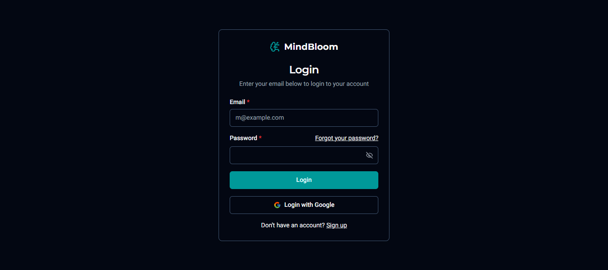
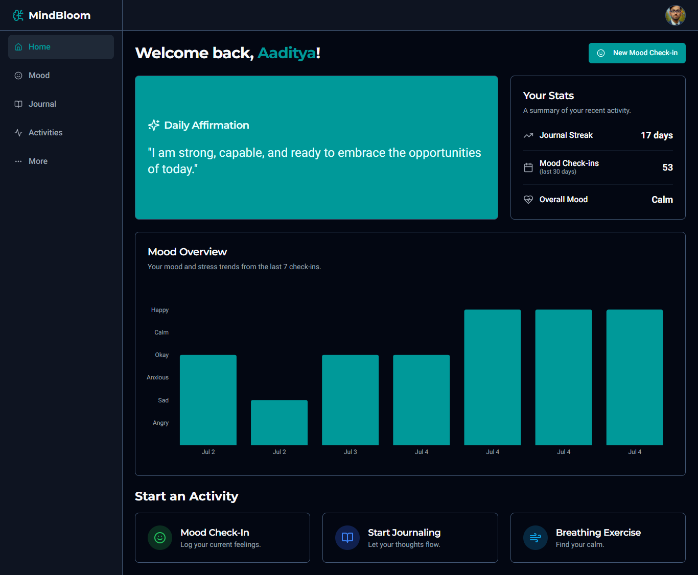

# MindBloom - Your Personal Wellness Companion


## 📝 Overview

MindBloom is a modern web application designed to be a safe and supportive space for users to focus on their mental well-being. By integrating AI-powered features with proven wellness techniques, the app provides personalized guidance to help users understand their emotions, practice self-reflection, and discover effective self-care strategies.


## ✨ Core Purpose & Goal

The primary goal of MindBloom is to empower users on their journey toward better mental health. It aims to provide accessible, engaging, and personalized tools that encourage consistent, positive habits. Whether it's through a moment of quiet reflection, a guided breathing exercise, or discovering a new coping strategy, MindBloom is here to support users every step of the way.


## 🚀 Key Features

### 1. **Mood Tracking & History**
   - **Daily Check-ins:** Users can log their current mood (e.g., Happy, Sad, Anxious) and stress level on a simple scale.
   - **Mood Visualization:** A beautiful chart on the dashboard and history page visualizes mood fluctuations and stress trends over time, helping users identify patterns.
   - **Detailed Log:** A complete history of all past check-ins is available, which can be edited or deleted.

### 2. **AI-Powered Journaling**
   - **Personalized Prompts:** Based on the user's selected mood, Genkit generates thoughtful and relevant journaling prompts to encourage self-reflection.
   - **Secure Entries:** A rich text editor provides a private space for users to write and save their thoughts.
   - **Past Entry Review:** Users can easily review, edit, or delete their past journal entries.

### 3. **AI-Driven Self-Care Suggestions**
   - **Tailored Activities:** After a mood check-in, the app uses Genkit to generate a list of personalized self-care activities. Suggestions are tailored to the user's mood, stress level, age, and recent journal entries.
   - **Activity Details:** Users can click on any suggestion to get a detailed, AI-generated guide on how to perform the activity, specifically framed to their current emotional state.

### 4. **Guided Breathing Exercises**
   - **Multiple Techniques:** The app includes several guided breathing exercises like Box Breathing, 4-7-8 Breathing, Belly Breathing, Pursed-Lip Breathing, and Alternate Nostril Breathing.
   - **Animated Visual Guide:** A clean, intuitive animator helps users synchronize their breath with the instructions (inhale, hold, exhale), making the practice easy and effective.

### 5. **Secure User Authentication & Profile Management**
   - **Email & Google Auth:** Users can sign up or log in securely using their email and password or their Google account.
   - **Personalized Profile:** Users can manage their profile information, including their name, date of birth (for age-tailored AI responses), and avatar.

### 6. **Daily Affirmations**
   - **Personalized Positive Messages:** The app generates daily affirmations to help users start their day with a positive mindset.


## 📸 Screenshots

### Login


### Dashboard



## 🛠️ Technology Stack

MindBloom is built with a modern, robust, and scalable tech stack:

- **Framework:** **Next.js 15.3.3** (App Router)
- **Language:** **TypeScript**
- **UI Components:** **ShadCN UI** (based on Radix UI primitives)
- **Styling:** **Tailwind CSS**
- **Generative AI:** **Genkit** with **Google's Gemini models**
- **Backend & Database:** **Firebase** (Authentication for users, Firestore for data storage)
- **UI Animation:** **Framer Motion**
- **Form Handling:** **React Hook Form** with **Zod** validation
- **Data Visualization:** **Recharts** for mood history charts


## 📁 Project Structure

```
src/
├── ai/                  # AI integration with Genkit
│   ├── flows/           # AI flows for different features
│   │   ├── generate-activity-details.ts
│   │   ├── generate-daily-affirmation.ts
│   │   ├── generate-journaling-prompts.ts
│   │   └── generate-self-care-activities.ts
│   └── genkit.ts        # Genkit configuration
├── app/                 # Next.js App Router pages
│   ├── home/            # Main app pages after login
│   │   ├── activities/  # Self-care and breathing exercises
│   │   ├── journal/     # Journaling feature
│   │   ├── mood/        # Mood tracking and history
│   │   └── more/        # Additional features
│   ├── register/        # User registration
│   └── page.tsx         # Landing page
├── components/          # Reusable UI components
│   └── ui/              # ShadCN UI components
├── hooks/               # Custom React hooks
└── lib/                 # Utility functions and configurations
    ├── firebase.ts      # Firebase configuration
    └── utils.ts         # Helper functions
```


## 🔧 Setup and Installation

### Prerequisites

- Node.js (v18 or higher)
- npm or yarn
- Firebase account
- Google AI (Gemini) API key

### Installation Steps

1. **Clone the repository**

```bash
git clone https://github.com/SolutionSneeker/MindBloom.git
cd MindBloom
```

2. **Install dependencies**

```bash
npm install
# or
yarn install
```

3. **Set up environment variables**

Create a `.env` file in the root directory with the following variables:

```
# Firebase Configuration
NEXT_PUBLIC_FIREBASE_API_KEY=your_firebase_api_key
NEXT_PUBLIC_FIREBASE_AUTH_DOMAIN=your_firebase_auth_domain
NEXT_PUBLIC_FIREBASE_PROJECT_ID=your_firebase_project_id
NEXT_PUBLIC_FIREBASE_STORAGE_BUCKET=your_firebase_storage_bucket
NEXT_PUBLIC_FIREBASE_MESSAGING_SENDER_ID=your_firebase_messaging_sender_id
NEXT_PUBLIC_FIREBASE_APP_ID=your_firebase_app_id

# Google AI (Gemini) API Key
GENKIT_API_KEY=your_genkit_api_key
```

4. **Run the development server**

```bash
npm run dev
# or
yarn dev
```

The application will be available at `http://localhost:9002`.


## 🧠 AI Integration

MindBloom uses Google's Gemini models through the Genkit library to provide personalized experiences:

1. **Journaling Prompts:** Generates thoughtful prompts based on the user's mood and age, encouraging meaningful self-reflection.
2. **Self-Care Activities:** Suggests personalized activities tailored to the user's emotional state, stress level, journal content, and age.
3. **Activity Details:** Provides detailed guides for performing self-care activities, with instructions specifically framed to address the user's current emotional needs.
4. **Daily Affirmations:** Creates positive affirmations to start the day, refreshed daily on the dashboard.

Each AI flow is defined in the `src/ai/flows/` directory with proper input validation using Zod schemas. The prompts are carefully designed to be supportive, empathetic, and avoid potentially harmful content.


## 🔒 Authentication and Data Storage

MindBloom uses Firebase for authentication and data storage:

1. **Authentication:** Users can sign up and log in using email/password or Google authentication.
2. **Firestore Database:** Stores user profiles, mood check-ins, journal entries, and other user data.


## 📱 Responsive Design

MindBloom is built with a mobile-first approach, ensuring an optimal experience across all devices:

- **Adaptive Layouts:** The UI automatically adjusts to different screen sizes, from smartphones to large desktop monitors.
- **Touch-Friendly Controls:** All interactive elements are sized appropriately for touch input on mobile devices.
- **Optimized Navigation:** The navigation menu collapses into a hamburger menu on smaller screens.
- **Responsive Charts:** Data visualizations adjust to maintain readability on all screen sizes.
- **Fluid Typography:** Text sizes scale proportionally based on viewport width.
- **Orientation Support:** The app works seamlessly in both portrait and landscape orientations on mobile devices.

The responsive design is implemented using Tailwind CSS's utility classes and ShadCN UI's responsive components, ensuring consistency and performance across all devices.


## 🚀 Deployment

MindBloom can be deployed to various platforms:

### Vercel (Recommended for Next.js apps)

1. **Connect Repository**
   - Link your GitHub, GitLab, or Bitbucket repository to Vercel
   - Select the repository containing MindBloom

2. **Configure Project**
   - Set the framework preset to Next.js
   - Configure the build settings (usually automatic)

3. **Set Environment Variables**
   - Add all required environment variables from your `.env` file
   - Ensure all Firebase and Genkit API keys are properly set

4. **Deploy**
   - Click deploy and Vercel will build and deploy your application
   - Your app will be available at a Vercel-generated URL

### Firebase Hosting

1. **Install Firebase CLI**
   ```bash
   npm install -g firebase-tools
   ```

2. **Login to Firebase**
   ```bash
   firebase login
   ```

3. **Initialize Firebase in your project**
   ```bash
   firebase init
   ```
   - Select Hosting
   - Choose your Firebase project
   - Set public directory to `out`
   - Configure as a single-page app

4. **Update Next.js configuration**
   - Modify `next.config.ts` to enable static exports:
   ```javascript
   module.exports = {
     output: 'export',
     // other config options...
   }
   ```

5. **Build the application**
   ```bash
   npm run build
   ```

6. **Deploy to Firebase**
   ```bash
   firebase deploy
   ```

### Docker Deployment

For containerized deployments, a Dockerfile is provided in the repository:

1. **Build the Docker image**
   ```bash
   docker build -t mindbloom .
   ```

2. **Run the container**
   ```bash
   docker run -p 3000:3000 -e NEXT_PUBLIC_FIREBASE_API_KEY=your_key -e GENKIT_API_KEY=your_key mindbloom
   ```

### Environment Variables

Regardless of deployment method, ensure these environment variables are configured:

```
# Firebase Configuration
NEXT_PUBLIC_FIREBASE_API_KEY=your_firebase_api_key
NEXT_PUBLIC_FIREBASE_AUTH_DOMAIN=your_firebase_auth_domain
NEXT_PUBLIC_FIREBASE_PROJECT_ID=your_firebase_project_id
NEXT_PUBLIC_FIREBASE_STORAGE_BUCKET=your_firebase_storage_bucket
NEXT_PUBLIC_FIREBASE_MESSAGING_SENDER_ID=your_firebase_messaging_sender_id
NEXT_PUBLIC_FIREBASE_APP_ID=your_firebase_app_id

# Google AI (Gemini) API Key
GENKIT_API_KEY=your_genkit_api_key
```


## 🤝 Contributing

Contributions to MindBloom are welcome and appreciated! Here's how you can contribute:

### Getting Started

1. **Fork the Repository**
   - Create your own fork of the project
   - Clone it to your local machine

2. **Set Up Development Environment**
   - Follow the installation steps in the Setup section
   - Make sure all dependencies are installed
   - Verify that the application runs correctly

### Making Changes

1. **Create a Branch**
   ```bash
   git checkout -b feature/your-feature-name
   ```

2. **Make Your Changes**
   - Follow the coding style and patterns used in the project
   - Add or update tests as necessary
   - Keep changes focused on a single feature or bug fix

3. **Test Your Changes**
   - Run the application locally to verify your changes work
   - Ensure all existing tests pass
   - Add new tests for new functionality

### Submitting Changes

1. **Commit Your Changes**
   ```bash
   git commit -m "Add feature: your feature description"
   ```

2. **Push to Your Fork**
   ```bash
   git push origin feature/your-feature-name
   ```

3. **Create a Pull Request**
   - Go to the original repository on GitHub
   - Click "New Pull Request"
   - Select your fork and branch
   - Provide a clear description of your changes

### Pull Request Guidelines

- **Title:** Use a clear and descriptive title
- **Description:** Explain what your changes do and why they should be included
- **Reference Issues:** Link to any related issues or discussions
- **Screenshots:** Include screenshots for UI changes

### Code Style Guidelines

- Follow TypeScript best practices
- Use meaningful variable and function names
- Write comments for complex logic
- Follow the existing project structure

We appreciate your contributions to making MindBloom better!


## 👤 Developers

- [Aaditya Kumar](https://github.com/AadityaGeek/)
- [Priyewrat](https://github.com/priyewrat/)
- [Gyandeep Raj](https://github.com/Gyandeepraj/)
- [Ruchi Kumari](https://github.com/Ruchi337/)


## 📄 License

This project is licensed under the MIT License - see the LICENSE file for details.

<!--
### MIT License Summary

The MIT License is a permissive license that allows you to:

- ✅ Use the code commercially
- ✅ Modify the code
- ✅ Distribute the code
- ✅ Use and modify the code privately

The only requirement is that the original copyright and license notice must be included in any copy of the software/source.

This license does not provide any warranty with the software and does not hold the authors liable for any damages arising from its use.
-->


## 🙏 Acknowledgements

MindBloom stands on the shoulders of these amazing technologies and communities:

### Core Framework & Libraries
- [Next.js](https://nextjs.org/) - The React framework for production that enables server-side rendering and static site generation
- [React](https://reactjs.org/) - A JavaScript library for building user interfaces
- [TypeScript](https://www.typescriptlang.org/) - Typed JavaScript at any scale

### UI & Styling
- [Tailwind CSS](https://tailwindcss.com/) - A utility-first CSS framework for rapid UI development
- [ShadCN UI](https://ui.shadcn.com/) - Re-usable components built with Radix UI and Tailwind CSS
- [Framer Motion](https://www.framer.com/motion/) - A production-ready motion library for React
- [Recharts](https://recharts.org/) - A composable charting library built on React components

### Backend & AI
- [Firebase](https://firebase.google.com/) - Google's platform for app development, providing authentication and database services
- [Genkit](https://genkit.ai/) - A framework for building AI-powered applications
- [Google Gemini](https://ai.google.dev/) - Google's multimodal AI model that powers the personalized features

### Form Handling & Validation
- [React Hook Form](https://react-hook-form.com/) - Performant, flexible and extensible forms with easy-to-use validation
- [Zod](https://github.com/colinhacks/zod) - TypeScript-first schema validation with static type inference

### Special Thanks
- To all the open-source contributors whose work makes projects like this possible
- To the mental health professionals whose research and insights inform our approach to wellness
- To our users who provide valuable feedback to help us improve
